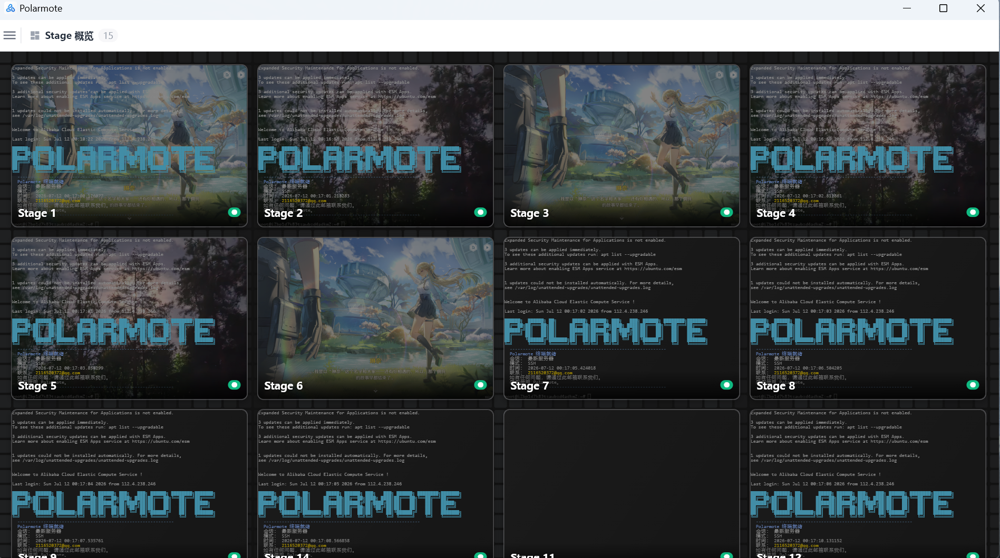

# Polarmote

跨平台终端模拟器与远程管理工具，基于 Flutter 构建。支持 SSH、本地 Shell、串口、Telnet 等多种协议，集成分屏终端、文件传输、脚本自动化、端口转发、AI 助手等功能。

## 截图

## 核心特性

**连接管理**
- SSH（密码/密钥/Agent 认证）、本地终端（PowerShell、CMD、WSL、bash）、串口、Telnet
- SSH ProxyJump 跳板机、SOCKS5 代理
- 会话树分组管理，支持搜索、筛选、排序、固定

**分屏终端**
- 水平/垂直/网格多布局，支持广播输入
- 终端搜索（正则）、块选择模式
- 字体/字号/配色/背景图片等外观可配置

**文件传输**
- SFTP 基于 Rust 原生加速引擎，支持上传/下载/批量队列
- 暂停、恢复、取消、自动重试
- 远程文件浏览与在线编辑

**脚本自动化**
- 脚本管理，支持文件夹分组和参数变量
- 工作流编排、批量模板执行
- Cron 定时调度、事件触发

**端口转发**
- 本地转发、远程转发、SOCKS5 动态代理
- 模板保存，支持连接时自动启动

**服务器监控**
- 服务器仪表盘，实时 CPU、内存等指标展示

**界面与个性化**
- 所有快捷键可自由重绑定，内置多套预设
- 中文 / English 多语言切换
- 深色 / 浅色模式

## 下载

从 [Releases](https://github.com/PNOS-770/Polarmote/releases) 下载对应平台的最新版本。

## License

Apache 2.0
